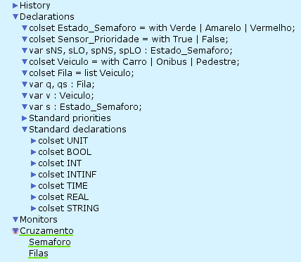
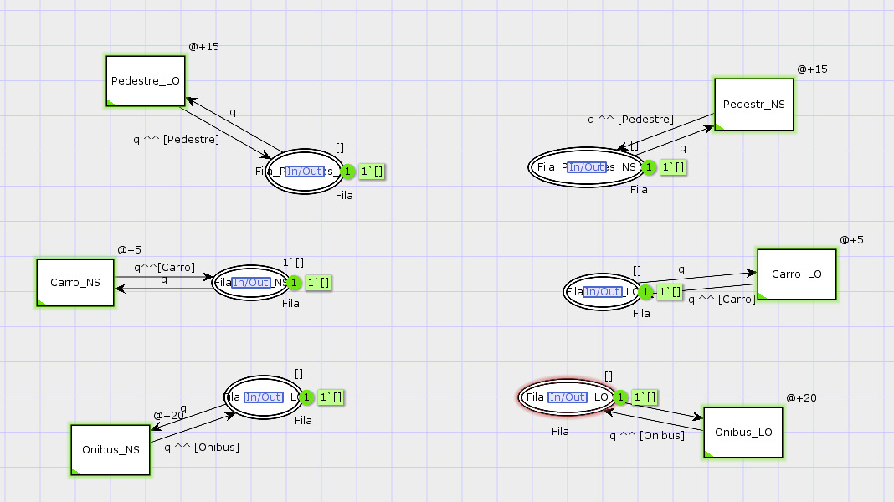
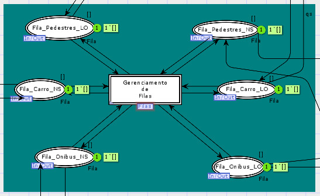
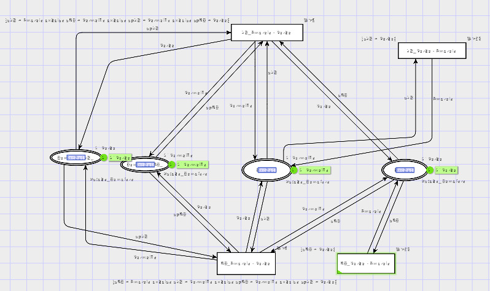
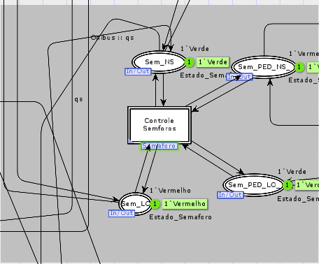

# Sistema-Controle-Trafego-HCPN
Modelagem de um Sistema de Controle de Tráfego Urbano Usando Redes de Petri Coloridas Hierárquicas (HCPN)

## Index
- [Descrição](#Descrição)
- [Estrutura](#Estrutura)
- [Declarações Globais (Declarations)](#Declarações-Globais-(Declarations))
- [Subpágina Filas](#Subpágina-Filas)
- [Subpágina Semaforos](#Subpágina-Semaforos)
- [Página Principal Cruzamento](#Página-Principal-Cruzamento)
- [Cenários](#Cenários)
- [Requisitos](#Requisitos)
- [Execução](#Execução)
- [Autores](#Autores)
- [Licença](#Licença)

## Descrição

Este projeto tem como finalidade a aplicação prática de Redes de Petri Coloridas Hierárquicas (HCPN) para a modelagem e o estudo de Sistemas a Eventos Discretos (SED). A abordagem HCPN incorpora o conceito de "cores" — dados anexados aos tokens — e uma estrutura hierárquica de módulos, o que permite representar sistemas complexos de maneira organizada e eficiente. Para desenvolver e analisar os modelos, foi utilizado o software CPN Tools.

O trabalho concentra-se no cenário de um sistema de controle de tráfego em um cruzamento de quatro vias. Sistemas de tráfego são exemplos clássicos de SED, nos quais eventos isolados — a chegada de um veículo, a mudança de um semáforo — provocam mudanças de estado. A estrutura hierárquica das HCPN foi explorada para dividir o sistema em componentes menores, simplificando a análise de aspectos como fluxo contínuo e eficiência.

O modelo representa um cruzamento de quatro vias (Via 1, Via 2, Via 3 e Via 4) com as seguintes características:

- Semáforos individuais para cada via.
- Simulação de filas de veículos em cada direção.
- Definição de ciclos semafóricos: verde por 30 segundos, amarelo por 5 segundos e vermelho por 60 segundos.
- Distinção entre tipos de veículos, como Carro e Ônibus.

O projeto apresenta a modelagem e simulação de um cruzamento de tráfego utilizando a ferramenta de Redes de Petri Coloridas (CPN). O objetivo é gerenciar o fluxo de veículos e pedestres de forma segura e eficiente, através da coordenação de semáforos e filas de espera.

## Estrutura

O modelo é organizado de forma hierárquica para simplificar a complexidade do sistema.

- **Nível superior (página "Pagina Principal"):** Oferece uma visão geral do cruzamento. Este nível contém o local central "Cruzamento" e quatro transições de substituição (`Via 1`, `Via 2`, `Via 3`, `Via 4`), onde cada uma representa um semáforo e sua via correspondente.
- **Módulos subordinados (páginas "Semaforo1", "Semaforo2", "Semaforo3", "Semaforo4"):** Cada página modela o comportamento de um semáforo e o fluxo de veículos de sua respectiva via.
    - **Controle de semáforos:** Modela as três fases do semáforo (Verde, Amarelo, Vermelho) usando lugares específicos para cada estado. As transições entre os estados são temporizadas para simular a duração de cada fase.
    - **Gerenciamento de filas:** Um lugar (ex: "Fila de veiculos 1") armazena os veículos que aguardam para cruzar. Os tokens neste lugar são coloridos para representar diferentes tipos de veículos.
    - **Temporização:** As transições são temporizadas para simular a duração real dos eventos. Por exemplo, a transição de Verde para Amarelo ocorre após 30 unidades de tempo (`@+30`), de Amarelo para Vermelho após 5 (`@+5`), e de Vermelho para Verde após 60 (`@+60`).

O modelo é estruturado hierarquicamente, composto por uma página principal, **`Cruzamento`**, e duas subpáginas de apoio: **`Semaforos`** e **`Filas`**.

## Declarações Globais (Declarations)

Antes de detalhar as páginas, é importante definir os tipos de dados (colorsets) que o modelo utiliza. Foram definidos estados para os semáforos (`Verde`, `Amarelo`, `Vermelho`), tipos de veículos (`Carro`, `Onibus`, `Pedestre`), e estruturas para as filas. O projeto utiliza dois conjuntos de cores principais:
        - `EstadoSemaforo`: Define os possíveis estados de um semáforo (`Verde`, `Amarelo`, `Vermelho`).
        - `Veiculo`: Define os tipos de veículos no sistema (`Carro`, `Onibus`, `Pedestre`).

---

## Subpágina Filas

A subpágina **`Filas`** é responsável por simular a chegada de entidades ao cruzamento. Transições temporizadas geram tokens (representando carros, ônibus e pedestres) e os inserem em lugares que funcionam como filas para cada direção: Norte-Sul (NS) e Leste-Oeste (LO).

* **Geração de Entidades:** Cria carros, ônibus e pedestres em intervalos de tempo definidos.
* **Armazenamento em Filas:** Adiciona as entidades geradas ao final da fila correspondente.

**Visão Detalhada da Geração nas Filas:**

 

**Visão Geral do Gerenciamento das Filas:**

---

## Subpágina Semaforos

Esta subpágina contém toda a lógica para o controle e a alternância dos sinais de trânsito. Ela garante que os semáforos para veículos e pedestres operem de forma sincronizada, passando pelos estados `Verde` -> `Amarelo` -> `Vermelho` e evitando condições de conflito (ex: dois sinais verdes para fluxos concorrentes).

**Visão Detalhada Semaforos:**

 

**Visão Geral dos Semaforos:**

---

## Página Principal Cruzamento

A página **`Cruzamento`** é o núcleo do modelo, onde a lógica das subpáginas `Filas` e `Semaforos` é integrada. Sua principal função é decidir qual entidade pode atravessar o cruzamento a cada momento.

* **Recebimento de Dados:** A página lê os tokens das filas e o estado atual de cada semáforo.
* **Lógica de Decisão:** Utilizando condições de guarda nas transições, o modelo verifica se o semáforo está verde para uma determinada fila que não esteja vazia.
* **Consumo de Entidades:** Se as condições forem atendidas, a transição é habilitada e "consome" a primeira entidade da fila correspondente, efetivamente simulando sua passagem pelo cruzamento.

## Cenários

O modelo atual está configurado para simular um cenário de tráfego normal, sem um sistema de prioridade explícito para ônibus. A configuração inicial do modelo inclui:
- **Via 3:** Um token do tipo `Carro` na fila de veículos.
- **Via 4:** Um token do tipo `Onibus` na fila de veículos.

Os semáforos operam em ciclos fixos e independentes, gerenciando o fluxo de veículos com base nos tempos pré-definidos para cada estado (verde, amarelo, vermelho).

## Requisitos

- [Ferramenta: CPN Tools](https://cpntools.org/)

## Autores

- [André Medeiros](https://github.com/andreemedeiros)
- [João Marcelo](https://github.com/marcello-rbr)
- [Vitor Lucas](https://github.com/Vitorluca)

Contribua com o projeto [Supervised-Control-Project](https://github.com/andreemedeiros/Sistema-Controle-Trafego/graphs/contributors)

Video explicativo no [Youtube](https://www.youtube.com/watch?v=sKgzRScjHkg)

## Licença

Este projeto é licenciado pela MIT License - veja [LICENSE.md](LICENSE.md) para mais detalhes.

## Execução

Com o CPN Tools instalado, execute o arquivo "ControleTrafego_v4.cpn".
